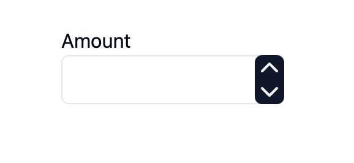
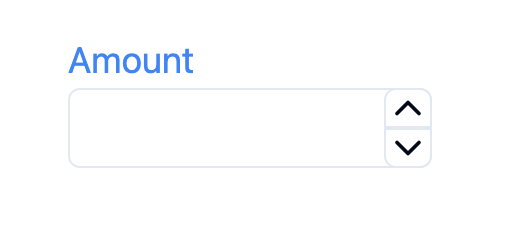
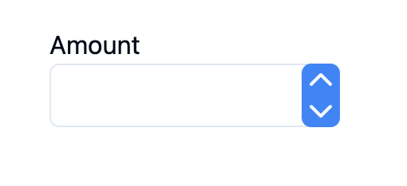

# Introduction of number-input

# Install

# Usage

## Basic

```tsx
<NumberField>
  <NumberFieldLabel>Amount: </NumberFieldLabel>
  <NumberFieldGroup>
    <NumberFieldIncrement>
      {/* ChevronUpIcon from 'lucide-react' */}
      <ChevronUpIcon />
    </NumberFieldIncrement>
    <NumberFieldInput />
    <NumberFieldDecrement>
      {/* ChevronDownIcon from 'lucide-react' */}
      <ChevronDownIcon />
    </NumberFieldDecrement>
  </NumberFieldGroup>
</NumberField>
```



## Customize

### Customize Label

```tsx
<NumberField label='Amount' labelPosition='top'>
  <NumberFieldLabel className='text-blue-500 text-lg'>Amount:</NumberFieldLabel>
  <NumberFieldGroup>
    <NumberFieldIncrement>
      <ChevronUpIcon />
    </NumberFieldIncrement>
    <NumberFieldInput />
    <NumberFieldDecrement>
      <ChevronDownIcon />
    </NumberFieldDecrement>
  </NumberFieldGroup>
</NumberField>
```



### Customize Increment & Decrement Buttons

```tsx
<NumberField>
  <NumberFieldLabel>Amount: </NumberFieldLabel>
  <NumberFieldGroup>
    {/* customize the increment button's style */}
    <NumberFieldIncrement className='bg-blue-500'>
      {/* customize the increment button's icon */}
      <ChevronUpIcon />
    </NumberFieldIncrement>
    <NumberFieldInput />
    {/* customize the decrement button's style */}
    <NumberFieldDecrement className='bg-blue-500'>
      {/* customize the decrement button's icon */}
      <ChevronDownIcon />
    </NumberFieldDecrement>
  </NumberFieldGroup>
</NumberField>
```



### Customize Input

# API Reference
