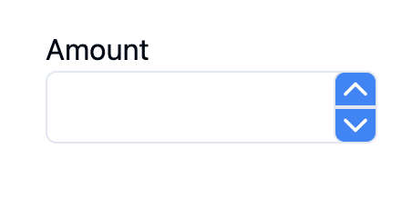
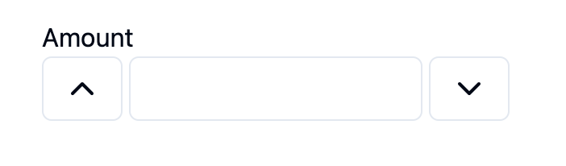
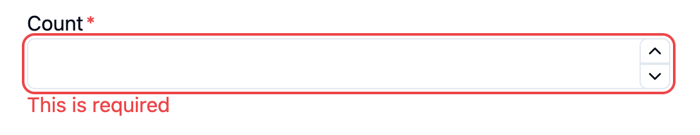
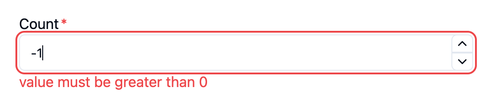

# Anatomy of number-input

`number-input` is a composite component used to create a number input field with custom buttons (for increment and decrement), labels, and an input. It is built based on the `react-aria` and `react-stately` libraries and provides a highly customizable user experience and accessibility. This component set includes the following subcomponents:

```tsx
<NumberField name="..." value="..." onChange={...} className="...">
  <NumberFieldLabel>{/* label */}</NumberFieldLabel>
  <NumberFieldGroup>
    <NumberFieldIncrement>{/* increment icon */}</NumberFieldIncrement>
    <NumberFieldInput className="..." />
    <NumberFieldDecrement>{/* decrement icon */}</NumberFieldDecrement>
  </NumberFieldGroup>
  <NumberFieldError />
</NumberField>
```


# Install

## Shadcn

```bash
npx shadcn@latest add "https://v0.dev/chat/b/oTN3LY2"
```

## Manually

- Make sure that the relevant dependencies of `react-aria` and `react-stately` have been installed.

- Copy the code in `packages/number-input/src/number-input.tsx` to your project.

- Then import the required modules in your component file.

# Usage

## Basic

```tsx
<NumberField>
  <NumberFieldLabel>Amount</NumberFieldLabel>
  <NumberFieldGroup>
    <NumberFieldIncrement>
      {/* ChevronUpIcon from 'lucide-react' */}
      <ChevronUpIcon />
    </NumberFieldIncrement>
    <NumberFieldInput />
    <NumberFieldDecrement>
      {/* ChevronDownIcon from 'lucide-react' */}
      <ChevronDownIcon />
    </NumberFieldDecrement>
  </NumberFieldGroup>
</NumberField>
```


## Integrating with HTML form

```tsx
<form
  action={create}
  // onSubmit={handleSubmit}
  className='flex gap-4 flex-col p-8'
>
  <input
    className='border border-gray-200'
    type='text'
    name='username'
    placeholder='username'
  />
  <input
    className='border border-gray-200'
    type='password'
    name='password'
    placeholder='password'
  />

  <NumberField name='amount' isRequired>
    <NumberFieldLabel>Amount</NumberFieldLabel>
    <NumberFieldGroup>
      <NumberFieldIncrement>
        <ChevronUpIcon className='h-4 w-4' />
      </NumberFieldIncrement>
      <NumberFieldInput />
      <NumberFieldDecrement>
        <ChevronDownIcon className='h-4 w-4' />
      </NumberFieldDecrement>
    </NumberFieldGroup>
    <NumberFieldError />
  </NumberField>
  <button type='submit'>submit</button>
</form>
```

## Integrating with Shadcn or react-hook-form

```tsx
const formSchema = z.object({
  username: z.string().min(2, {
    message: 'Username must be at least 2 characters.',
  }),
  password: z.string().min(2, {
    message: 'Password must be at least 2 characters.',
  }),
  amount: z.number().nonnegative(),
});

export default function ProfileForm() {
  const form = useForm<z.infer<typeof formSchema>>({
    resolver: zodResolver(formSchema),
    defaultValues: {
      username: '',
      password: '',
      amount: 0,
    },
  });

  function onSubmit(values: z.infer<typeof formSchema>) {
    const formData = new FormData();
    Object.entries(values).forEach(([key, value]) => {
      formData.append(key, value.toString());
    });

    // create(formData);
  }

  return (
    <Form {...form}>
      <form onSubmit={form.handleSubmit(onSubmit)} className='space-y-8'>
        <FormField
          control={form.control}
          name='username'
          render={({ field }) => (
            <FormItem>
              <FormLabel>Username</FormLabel>
              <FormControl>
                <Input placeholder='username' {...field} />
              </FormControl>
              <FormMessage />
            </FormItem>
          )}
        />
        <FormField
          control={form.control}
          name='password'
          render={({ field }) => (
            <FormItem>
              <FormLabel>Password</FormLabel>
              <FormControl>
                <Input type='password' placeholder='password' {...field} />
              </FormControl>
              <FormMessage />
            </FormItem>
          )}
        />
        <FormField
          control={form.control}
          name='amount'
          render={({ field: { onChange, value } }) => (
            <FormItem>
              <FormLabel>Amount</FormLabel>
              <FormControl>
                <NumberField
                  onChange={onChange}
                  value={value}
                  className='gap-0'
                >
                  <NumberFieldGroup>
                    <NumberFieldDecrement>
                      <ChevronDownIcon className='h-4 w-4' />
                    </NumberFieldDecrement>
                    <NumberFieldInput />
                    <NumberFieldIncrement>
                      <ChevronUpIcon className='h-4 w-4' />
                    </NumberFieldIncrement>
                  </NumberFieldGroup>
                </NumberField>
              </FormControl>
              <FormMessage />
            </FormItem>
          )}
        />
        <Button type='submit'>Submit</Button>
      </form>
    </Form>
  );
}
```

## Input

### Value

A NumberField's `value` is empty by default, but an initial, uncontrolled, value can be provided using the `defaultValue` prop. Alternatively, a controlled value can be provided using the `value` prop.

- `value`: The current value (controlled).
- `defaultValue`: The default value (uncontrolled).
- `minValue`: The smallest value allowed for the input.
- `maxValue`: The largest value allowed for the input.

```tsx
    let [value, setValue] = React.useState(15);

    <NumberField label='defaultValue' defaultValue={8}>
      <NumberFieldLabel>defaultValue</NumberFieldLabel>
      <NumberFieldGroup>
        <NumberFieldIncrement>
          <ChevronUpIcon />
        </NumberFieldIncrement>
        <NumberFieldInput />
        <NumberFieldDecrement>
          <ChevronDownIcon />
        </NumberFieldDecrement>
      </NumberFieldGroup>
    </NumberField>

    <NumberField label='value' value={value} onChange={setValue}>
      <NumberFieldLabel>value</NumberFieldLabel>
      <NumberFieldGroup>
        <NumberFieldIncrement>
          <ChevronUpIcon />
        </NumberFieldIncrement>
        <NumberFieldInput />
        <NumberFieldDecrement>
          <ChevronDownIcon />
        </NumberFieldDecrement>
      </NumberFieldGroup>
    </NumberField>
```

#### Minimum and Maximum and Step

- Minimum and maximum values

The `minValue` and `maxValue` props can be used to limit the entered value to a specific range. The value will be clamped when the user blurs the input field. In addition, the increment and decrement buttons will be disabled when the value is within one `step` value from the bounds. Ranges can be open ended by only providing either `minValue` or `maxValue` rather than both.

If a valid range is known ahead of time, it is a good idea to provide it to `NumberField` so it can optimize the experience. For example, when the minimum value is greater than or equal to zero, it is possible to use a numeric keyboard on iOS rather than a full text keyboard (necessary to enter a minus sign).

- Step values

The `step` prop can be used to snap the value to certain increments. If there is a `minValue` defined, the steps are calculated starting from the minimum. For example, if `minValue={2}`, and `step={3}`, the valid step values would be 2, 5, 8, 11, etc. If no `minValue` is defined, the steps are calculated starting from zero and extending in both directions. In other words, such that the values are evenly divisible by the step. If no `step` is defined, any decimal value may be typed, but incrementing and decrementing snaps the value to an integer.

If the user types a value that is between two steps and blurs the input, the value will be snapped to the nearest step. When incrementing or decrementing, the value is snapped to the nearest step that is higher or lower, respectively. When incrementing or decrementing from an empty field, the value starts at the `minValue` or `maxValue`, respectively, if defined. Otherwise, the value starts from `0`.

```tsx
<NumberField label='min-max' minValue={0} maxValue={10} step={3}>
  <NumberFieldLabel>min-max</NumberFieldLabel>
  <NumberFieldGroup>
    <NumberFieldIncrement>
      <ChevronUpIcon />
    </NumberFieldIncrement>
    <NumberFieldInput />
    <NumberFieldDecrement>
      <ChevronDownIcon />
    </NumberFieldDecrement>
  </NumberFieldGroup>
</NumberField>
```

### Style

The `NumberFieldInput` style can be fully customized.

```tsx
<NumberField>
  <NumberFieldLabel>Amount</NumberFieldLabel>
  <NumberFieldGroup>
    <NumberFieldIncrement>
      <ChevronUpIcon />
    </NumberFieldIncrement>
    <NumberFieldInput className='border-blue-500 w-[500px] focus-visible:ring-blue-500' />
    <NumberFieldDecrement>
      <ChevronDownIcon />
    </NumberFieldDecrement>
  </NumberFieldGroup>
</NumberField>
```


### Behavior

NumberField accepts an `onChange` prop which is triggered whenever the value is committed by the user. This happens on blur of the field or on interaction with the stepper functionality, arrow keys or stepper buttons.

```tsx
let [value, setValue] = React.useState(0);

<NumberField label='Amount' onChange={setValue} minValue={0}>
  <NumberFieldLabel>Amount</NumberFieldLabel>
  <NumberFieldGroup>
    <NumberFieldIncrement>
      <ChevronUpIcon />
    </NumberFieldIncrement>
    <NumberFieldInput />
    <NumberFieldDecrement>
      <ChevronDownIcon />
    </NumberFieldDecrement>
  </NumberFieldGroup>
</NumberField>;
```

### Number formatting

The NumberField value can be formatted by using the `formatOptions` prop. `formatOptions` is compatible with the option parameter of [Intl.NumberFormat](https://developer.mozilla.org/en-US/docs/Web/JavaScript/Reference/Global_Objects/NumberFormat) and is applied based on the current locale. Currently only standard notation is supported, though scientific, engineering, and compact notation may be supported in the future.

NumberField supports three numeral systems; Latin, Arabic-Indic, and Han positional decimal. Regardless of the locale, these three can be parsed from typed input. Initial rendering will appear in the [default numeral system](https://developer.mozilla.org/en-US/docs/Web/JavaScript/Reference/Global_Objects/Intl/Locale/numberingSystem) for the locale unless explicitly overridden.

#### Decimals

The following example uses the `signDisplay` option to include the plus sign for positive numbers, for example to display an offset from some value. In addition, it always displays a minimum of 1 digit after the decimal point, and allows up to 2 fraction digits. If the user enters more than 2 fraction digits, the result will be rounded.

```tsx
<NumberField
  label='Decimals'
  defaultValue={0}
  formatOptions={{
    signDisplay: 'exceptZero',
    minimumFractionDigits: 1,
    maximumFractionDigits: 2,
  }}
>
  <NumberFieldLabel>Decimals</NumberFieldLabel>
  <NumberFieldGroup>
    <NumberFieldIncrement>
      <ChevronUpIcon />
    </NumberFieldIncrement>
    <NumberFieldInput />
    <NumberFieldDecrement>
      <ChevronDownIcon />
    </NumberFieldDecrement>
  </NumberFieldGroup>
</NumberField>
```

#### Percentages

The `style: 'percent'` option can be passed to the `formatOptions` prop to treat the value as a percentage. In this mode, the value is multiplied by 100 before it is displayed, i.e. `0.45` is displayed as `45%`. The reverse is also true: when the user enters a value, the `onChange` event will be triggered with the entered value divided by 100. When the percent option is enabled, the default step automatically changes to `0.01` such that incrementing and decrementing occurs by `1%`. This can be overridden with the `step` prop.

```tsx
<NumberField
  label='Percentages'
  formatOptions={{ style: 'percent' }}
  minValue={0}
  defaultValue={0.05}
>
  <NumberFieldLabel>Percentages</NumberFieldLabel>
  <NumberFieldGroup>
    <NumberFieldIncrement>
      <ChevronUpIcon />
    </NumberFieldIncrement>
    <NumberFieldInput />
    <NumberFieldDecrement>
      <ChevronDownIcon />
    </NumberFieldDecrement>
  </NumberFieldGroup>
</NumberField>
```

#### Currency values

The `style: 'currency'` option can be passed to the `formatOptions` prop to treat the value as a currency value. The `currency` option must also be passed to set the currency code (e.g. `USD`) to use. In addition, the `currencyDisplay` option can be used to choose whether to display the currency symbol, currency code, or currency name. Finally, the `currencySign` option can be set to `accounting` to use accounting notation for negative numbers, which uses parentheses rather than a minus sign in some locales.

If you need to allow the user to change the currency, you should include a separate dropdown next to the NumberField. The NumberField itself will not determine the currency from the user input.

```tsx
<NumberField
  label='Currency'
  defaultValue={45}
  formatOptions={{
    style: 'currency',
    currency: 'EUR',
    currencyDisplay: 'code',
    currencySign: 'accounting',
  }}
>
  <NumberFieldLabel>Currency</NumberFieldLabel>
  <NumberFieldGroup>
    <NumberFieldIncrement>
      <ChevronUpIcon />
    </NumberFieldIncrement>
    <NumberFieldInput />
    <NumberFieldDecrement>
      <ChevronDownIcon />
    </NumberFieldDecrement>
  </NumberFieldGroup>
</NumberField>
```

#### Units

The `style: 'unit'` option can be passed to the `formatOptions` prop to format the value with a unit of measurement. The `unit` option must also be passed to set which unit to use (e.g. `inch`). In addition, the `unitDisplay` option can be used to choose whether to display the unit in long, short, or narrow format.

If you need to allow the user to change the unit, you should include a separate dropdown next to the number field. The number field itself will not determine the unit from the user input.

**Note:** The `unit` style is not currently supported in Safari. A [polyfill](https://formatjs.io/docs/polyfills/intl-numberformat/) may be necessary.

```tsx
<NumberField
  label='Units'
  defaultValue={4}
  minValue={0}
  formatOptions={{
    style: 'unit',
    unit: 'inch',
    unitDisplay: 'long',
  }}
>
  <NumberFieldLabel>Units</NumberFieldLabel>
  <NumberFieldGroup>
    <NumberFieldIncrement>
      <ChevronUpIcon />
    </NumberFieldIncrement>
    <NumberFieldInput />
    <NumberFieldDecrement>
      <ChevronDownIcon />
    </NumberFieldDecrement>
  </NumberFieldGroup>
</NumberField>
```

### Disabled and read only

The `isDisabled` and `isReadOnly` props can be used prevent the user from editing the value of the number field. The difference is that `isReadOnly` still allows the input to be focused, while `isDisabled` prevents all user interaction.

```tsx
<>
  <NumberField label='Disabled' isDisabled value={25}>
    <NumberFieldLabel>Disabled</NumberFieldLabel>
    <NumberFieldGroup>
      <NumberFieldIncrement>
        <ChevronUpIcon />
      </NumberFieldIncrement>
      <NumberFieldInput />
      <NumberFieldDecrement>
        <ChevronDownIcon />
      </NumberFieldDecrement>
    </NumberFieldGroup>
  </NumberField>

  <NumberField label='Read only' isReadOnly value={28}>
    <NumberFieldLabel>Read only</NumberFieldLabel>
    <NumberFieldGroup>
      <NumberFieldIncrement>
        <ChevronUpIcon />
      </NumberFieldIncrement>
      <NumberFieldInput />
      <NumberFieldDecrement>
        <ChevronDownIcon />
      </NumberFieldDecrement>
    </NumberFieldGroup>
  </NumberField>
</>
```

## Label

For better accessibility, a label should be added to `NumberField`

### Style & Position

The `NumberFieldLabel` style can be fully customized

```tsx
<NumberField label='Amount'>
  <NumberFieldLabel className='text-blue-500 text-lg'>Amount</NumberFieldLabel>
  <NumberFieldGroup>
    <NumberFieldIncrement>
      <ChevronUpIcon />
    </NumberFieldIncrement>
    <NumberFieldInput />
    <NumberFieldDecrement>
      <ChevronDownIcon />
    </NumberFieldDecrement>
  </NumberFieldGroup>
</NumberField>
```


## Buttons

### Style

You can fully customize the button style and its children.

```tsx
<NumberField>
  <NumberFieldLabel>Amount</NumberFieldLabel>
  <NumberFieldGroup>
    {/* customize the increment button's style */}
    <NumberFieldIncrement className='bg-blue-500'>
      {/* customize the increment button's icon */}
      <ChevronUpIcon />
    </NumberFieldIncrement>
    <NumberFieldInput />
    {/* customize the decrement button's style */}
    <NumberFieldDecrement className='bg-blue-500'>
      {/* customize the decrement button's icon */}
      <ChevronDownIcon />
    </NumberFieldDecrement>
  </NumberFieldGroup>
</NumberField>
```



### Position

`btnPosition` has two values, one is `inside`, which is the default value, and the other is `outside`

```tsx
<NumberField btnPosition='outside'>
  <NumberFieldLabel>Amount</NumberFieldLabel>
  <NumberFieldGroup>
    <NumberFieldIncrement>
      <ChevronUpIcon />
    </NumberFieldIncrement>
    <NumberFieldInput />
    <NumberFieldDecrement>
      <ChevronDownIcon />
    </NumberFieldDecrement>
  </NumberFieldGroup>
</NumberField>
```



## Validation

### isRequired

```tsx
<form className='flex gap-4 flex-col p-8'>
  <NumberField name='amount' isRequired>
    <NumberFieldLabel>
      <span className="after:content-['*'] after:ml-0.5 after:text-red-500">
        Amount
      </span>
    </NumberFieldLabel>
    <NumberFieldGroup>
      <NumberFieldIncrement>
        <ChevronUpIcon className='h-4 w-4' />
      </NumberFieldIncrement>
      <NumberFieldInput />
      <NumberFieldDecrement>
        <ChevronDownIcon className='h-4 w-4' />
      </NumberFieldDecrement>
    </NumberFieldGroup>
    <NumberFieldError />
  </NumberField>

  <div className='flex gap-4 justify-around'>
    <button type='submit'>submit</button>
    <button type='reset'>reset</button>
  </div>
</form>
```

### Customizing error messages

By default, displays the error message provided by the browser, which is localized in the user's preferred language. You can customize these messages by providing a function to the `errorMessage` prop. This receives a list of error strings along with a [ValidityState](https://developer.mozilla.org/en-US/docs/Web/API/ValidityState) object describing why the field is invalid, and should return an error message to display.

```tsx
<form className='flex gap-4 flex-col p-8'>
  <NumberField
    name='amount'
    isRequired
    // errorMessage='This is required'
    errorMessage={(validationResult) => {
      if (validationResult.validationDetails.valueMissing) {
        return <p>This is required</p>;
      }
    }}
  >
    <NumberFieldLabel className=''>
      <span className="after:content-['*'] after:ml-0.5 after:text-red-500">
        Amount
      </span>
    </NumberFieldLabel>
    <NumberFieldGroup className=''>
      <NumberFieldIncrement>
        <ChevronUpIcon className='h-4 w-4' />
      </NumberFieldIncrement>
      <NumberFieldInput />
      <NumberFieldDecrement>
        <ChevronDownIcon className='h-4 w-4' />
      </NumberFieldDecrement>
    </NumberFieldGroup>
    <NumberFieldError />
  </NumberField>

  <div className='flex gap-4 justify-around'>
    <button type='submit'>submit</button>
    <button type='reset'>reset</button>
  </div>
</form>
```



### Custom validation

Custom validation is supported by providing a function to the `validate` prop. This function receives the current field value, and can return a string or array of strings representing one or more error messages. These are displayed to the user after the value is committed (e.g. on blur) to avoid distracting them on each keystroke.

```tsx
<form className='flex gap-4 flex-col p-8'>
  <NumberField
    name='amount'
    validate={(value) => {
      if (value < 0) {
        return 'value must be greater than 0';
      }
    }}
  >
    <NumberFieldLabel>
      <span className="after:content-['*'] after:ml-0.5 after:text-red-500">
        Amount
      </span>
    </NumberFieldLabel>
    <NumberFieldGroup>
      <NumberFieldIncrement>
        <ChevronUpIcon className='h-4 w-4' />
      </NumberFieldIncrement>
      <NumberFieldInput />
      <NumberFieldDecrement>
        <ChevronDownIcon className='h-4 w-4' />
      </NumberFieldDecrement>
    </NumberFieldGroup>
    <NumberFieldError />
  </NumberField>

  <div className='flex gap-4 justify-around'>
    <button type='submit'>submit</button>
    <button type='reset'>reset</button>
  </div>
</form>
```



# Props Reference

## NumberFieldProps

### Props for NumberField's container

| Name        | Type                                                                                        | Default | Descriptiion                          |
| ----------- | ------------------------------------------------------------------------------------------- | ------- | ------------------------------------- |
| `className` | [string](https://developer.mozilla.org/docs/Web/JavaScript/Reference/Global_Objects/String) | —       | className for NumberField's container |

### Props for input

| Name                  | Type                                                                                                                                                                                                                                                                                                                                                                                                                                                                                                      | Default            | Descriptiion                                                                                                                                                                                                                                                                                                                                                                                                                                                        |
| --------------------- | --------------------------------------------------------------------------------------------------------------------------------------------------------------------------------------------------------------------------------------------------------------------------------------------------------------------------------------------------------------------------------------------------------------------------------------------------------------------------------------------------------- | ------------------ | ------------------------------------------------------------------------------------------------------------------------------------------------------------------------------------------------------------------------------------------------------------------------------------------------------------------------------------------------------------------------------------------------------------------------------------------------------------------- |
| `name`                | [string](https://developer.mozilla.org/docs/Web/JavaScript/Reference/Global_Objects/String)                                                                                                                                                                                                                                                                                                                                                                                                               | —                  | The `name` of input                                                                                                                                                                                                                                                                                                                                                                                                                                                 |
| `value`               | [number](https://developer.mozilla.org/docs/Web/JavaScript/Reference/Global_Objects/Number)                                                                                                                                                                                                                                                                                                                                                                                                               | —                  | The current value (controlled).                                                                                                                                                                                                                                                                                                                                                                                                                                     |
| `defaultValue`        | [number](https://developer.mozilla.org/docs/Web/JavaScript/Reference/Global_Objects/Number)                                                                                                                                                                                                                                                                                                                                                                                                               | —                  | The default value (uncontrolled).                                                                                                                                                                                                                                                                                                                                                                                                                                   |
| `minValue`            | [number](https://developer.mozilla.org/docs/Web/JavaScript/Reference/Global_Objects/Number)                                                                                                                                                                                                                                                                                                                                                                                                               | —                  | The smallest value allowed for the input.                                                                                                                                                                                                                                                                                                                                                                                                                           |
| `maxValue`            | [number](https://developer.mozilla.org/docs/Web/JavaScript/Reference/Global_Objects/Number)                                                                                                                                                                                                                                                                                                                                                                                                               | —                  | The largest value allowed for the input.                                                                                                                                                                                                                                                                                                                                                                                                                            |
| `step`                | [number](https://developer.mozilla.org/docs/Web/JavaScript/Reference/Global_Objects/Number)                                                                                                                                                                                                                                                                                                                                                                                                               | —                  | The amount that the input value changes with each increment or decrement "tick".                                                                                                                                                                                                                                                                                                                                                                                    |
| `formatOptions`       | [Intl.NumberFormatOptions](https://developer.mozilla.org/en-US/docs/Web/JavaScript/Reference/Global_Objects/Intl/NumberFormat/NumberFormat)                                                                                                                                                                                                                                                                                                                                                               | —                  | Formatting options for the value displayed in the number field. This also affects what characters are allowed to be typed by the user.                                                                                                                                                                                                                                                                                                                              |
| `autoFocus`           | [boolean](https://developer.mozilla.org/docs/Web/JavaScript/Reference/Global_Objects/Boolean)                                                                                                                                                                                                                                                                                                                                                                                                             | —                  | Whether the element should receive focus on render.                                                                                                                                                                                                                                                                                                                                                                                                                 |
| `placeholder`         | [string](https://developer.mozilla.org/docs/Web/JavaScript/Reference/Global_Objects/String)                                                                                                                                                                                                                                                                                                                                                                                                               | —                  | Temporary text that occupies the text input when it is empty.                                                                                                                                                                                                                                                                                                                                                                                                       |
| `locale`              | [string](https://developer.mozilla.org/docs/Web/JavaScript/Reference/Global_Objects/String)                                                                                                                                                                                                                                                                                                                                                                                                               | the current locale | The locale that should be used for parsing.                                                                                                                                                                                                                                                                                                                                                                                                                         |
| `isDisabled`          | [boolean](https://developer.mozilla.org/docs/Web/JavaScript/Reference/Global_Objects/Boolean)                                                                                                                                                                                                                                                                                                                                                                                                             | —                  | Whether the input is disabled.                                                                                                                                                                                                                                                                                                                                                                                                                                      |
| `isReadOnly`          | [boolean](https://developer.mozilla.org/docs/Web/JavaScript/Reference/Global_Objects/Boolean)                                                                                                                                                                                                                                                                                                                                                                                                             | —                  | Whether the input can be selected but not changed by the user.                                                                                                                                                                                                                                                                                                                                                                                                      |
| `isWheelDisabled`     | [boolean](https://developer.mozilla.org/docs/Web/JavaScript/Reference/Global_Objects/Boolean)                                                                                                                                                                                                                                                                                                                                                                                                             | —                  | Enables or disables changing the value with scroll.                                                                                                                                                                                                                                                                                                                                                                                                                 |
| `onChange`            | (value: T) => void                                                                                                                                                                                                                                                                                                                                                                                                                                                                                        | —                  | Handler that is called when the value changes.                                                                                                                                                                                                                                                                                                                                                                                                                      |
| `onFocus`             | (e: [FocusEvent](https://developer.mozilla.org/docs/Web/API/FocusEvent)<Target>) => void                                                                                                                                                                                                                                                                                                                                                                                                                  | —                  | Handler that is called when the element receives focus.                                                                                                                                                                                                                                                                                                                                                                                                             |
| `onBlur`              | (e: [FocusEvent](https://developer.mozilla.org/docs/Web/API/FocusEvent)<Target>) => void                                                                                                                                                                                                                                                                                                                                                                                                                  | —                  | Handler that is called when the element loses focus.                                                                                                                                                                                                                                                                                                                                                                                                                |
| `onFocusChange`       | (isFocused: [boolean](https://developer.mozilla.org/docs/Web/JavaScript/Reference/Global_Objects/Boolean)) => void                                                                                                                                                                                                                                                                                                                                                                                        | —                  | Handler that is called when the element's focus status changes.                                                                                                                                                                                                                                                                                                                                                                                                     |
| `onKeyDown`           | (e: [KeyboardEvent](https://react-spectrum.adobe.com/react-aria/useNumberField.html#/tmp/827df33ce4b0199e40d518d07d7acd9e/node_modules/@react-types/shared/src/events.d.ts:KeyboardEvent)) => void                                                                                                                                                                                                                                                                                                        | —                  | Handler that is called when a key is pressed.                                                                                                                                                                                                                                                                                                                                                                                                                       |
| `onKeyUp`             | (e: [KeyboardEvent](https://react-spectrum.adobe.com/react-aria/useNumberField.html#/tmp/827df33ce4b0199e40d518d07d7acd9e/node_modules/@react-types/shared/src/events.d.ts:KeyboardEvent)) => void                                                                                                                                                                                                                                                                                                        | —                  | Handler that is called when a key is released.                                                                                                                                                                                                                                                                                                                                                                                                                      |
| `onCopy`              | ClipboardEventHandler<[HTMLInputElement](https://developer.mozilla.org/docs/Web/API/HTMLInputElement)>                                                                                                                                                                                                                                                                                                                                                                                                    | —                  | Handler that is called when the user copies text. See [MDN](https://developer.mozilla.org/en-US/docs/Web/API/HTMLElement/oncopy).                                                                                                                                                                                                                                                                                                                                   |
| `onCut`               | ClipboardEventHandler<[HTMLInputElement](https://developer.mozilla.org/docs/Web/API/HTMLInputElement)>                                                                                                                                                                                                                                                                                                                                                                                                    | —                  | Handler that is called when the user cuts text. See [MDN](https://developer.mozilla.org/en-US/docs/Web/API/HTMLElement/oncut).                                                                                                                                                                                                                                                                                                                                      |
| `onPaste`             | ClipboardEventHandler<[HTMLInputElement](https://developer.mozilla.org/docs/Web/API/HTMLInputElement)>                                                                                                                                                                                                                                                                                                                                                                                                    | —                  | Handler that is called when the user pastes text. See [MDN](https://developer.mozilla.org/en-US/docs/Web/API/HTMLElement/onpaste).                                                                                                                                                                                                                                                                                                                                  |
| `onSelect`            | ReactEventHandler<[HTMLInputElement](https://developer.mozilla.org/docs/Web/API/HTMLInputElement)>                                                                                                                                                                                                                                                                                                                                                                                                        | —                  | Handler that is called when text in the input is selected. See [MDN](https://developer.mozilla.org/en-US/docs/Web/API/Element/select_event).                                                                                                                                                                                                                                                                                                                        |
| `onBeforeInput`       | FormEventHandler<[HTMLInputElement](https://developer.mozilla.org/docs/Web/API/HTMLInputElement)>                                                                                                                                                                                                                                                                                                                                                                                                         | —                  | Handler that is called when the input value is about to be modified. See [MDN](https://developer.mozilla.org/en-US/docs/Web/API/HTMLElement/beforeinput_event).                                                                                                                                                                                                                                                                                                     |
| `onInput`             | FormEventHandler<[HTMLInputElement](https://developer.mozilla.org/docs/Web/API/HTMLInputElement)>                                                                                                                                                                                                                                                                                                                                                                                                         | —                  | Handler that is called when the input value is modified. See [MDN](https://developer.mozilla.org/en-US/docs/Web/API/HTMLElement/input_event).                                                                                                                                                                                                                                                                                                                       |
| `onCompositionStart`  | CompositionEventHandler<[HTMLInputElement](https://developer.mozilla.org/docs/Web/API/HTMLInputElement)>                                                                                                                                                                                                                                                                                                                                                                                                  | —                  | Handler that is called when a text composition system starts a new text composition session. See [MDN](https://developer.mozilla.org/en-US/docs/Web/API/Element/compositionstart_event).                                                                                                                                                                                                                                                                            |
| `onCompositionEnd`    | CompositionEventHandler<[HTMLInputElement](https://developer.mozilla.org/docs/Web/API/HTMLInputElement)>                                                                                                                                                                                                                                                                                                                                                                                                  | —                  | Handler that is called when a text composition system completes or cancels the current text composition session. See [MDN](https://developer.mozilla.org/en-US/docs/Web/API/Element/compositionend_event).                                                                                                                                                                                                                                                          |
| `onCompositionUpdate` | CompositionEventHandler<[HTMLInputElement](https://developer.mozilla.org/docs/Web/API/HTMLInputElement)>                                                                                                                                                                                                                                                                                                                                                                                                  | —                  | Handler that is called when a new character is received in the current text composition session. See [MDN](https://developer.mozilla.org/en-US/docs/Web/API/Element/compositionupdate_event).                                                                                                                                                                                                                                                                       |
| `isRequired`          | [boolean](https://developer.mozilla.org/docs/Web/JavaScript/Reference/Global_Objects/Boolean)                                                                                                                                                                                                                                                                                                                                                                                                             | —                  | Whether user input is required on the input before form submission.                                                                                                                                                                                                                                                                                                                                                                                                 |
| `validationBehavior`  | `'aria' \| 'native'`                                                                                                                                                                                                                                                                                                                                                                                                                                                                                      | `'native'`         | Whether to use native HTML form validation to prevent form submission when the value is missing or invalid, or mark the field as required or invalid via ARIA.                                                                                                                                                                                                                                                                                                      |
| `validate`            | (value: [number](https://developer.mozilla.org/docs/Web/JavaScript/Reference/Global_Objects/Number)) => [ValidationError](https://react-spectrum.adobe.com/react-aria/useNumberField.html#/tmp/827df33ce4b0199e40d518d07d7acd9e/node_modules/@react-types/shared/src/inputs.d.ts:ValidationError) \| true \| [null](https://developer.mozilla.org/docs/Web/JavaScript/Reference/Global_Objects/null) \| [undefined](https://developer.mozilla.org/docs/Web/JavaScript/Reference/Global_Objects/undefined) | —                  | This is a function for custom validation rules and returns error message, if a given value is invalid.                                                                                                                                                                                                                                                                                                                                                              |
| `errorMessage`        | [ReactNode](https://reactjs.org/docs/rendering-elements.html) \| (v: [ValidationResult](https://react-spectrum.adobe.com/react-aria/useNumberField.html#/tmp/827df33ce4b0199e40d518d07d7acd9e/node_modules/@react-types/shared/src/inputs.d.ts:ValidationResult)) => [ReactNode](https://reactjs.org/docs/rendering-elements.html)                                                                                                                                                                        | —                  | Customizing error messages. By default, displays the error message provided by the browser, which is localized in the user's preferred language. You can customize these messages by providing a function to the `errorMessage` prop. This receives a list of error strings along with a [ValidityState](https://developer.mozilla.org/en-US/docs/Web/API/ValidityState) object describing why the field is invalid, and should return an error message to display. |

### Props for button

| Name          | Type                  | Default  | Descriptiion                    |
| ------------- | --------------------- | -------- | ------------------------------- |
| `btnPosition` | "inside" \| "outside" | "inside" | Set the position of the button. |

### Props for label

| Name            | Type            | Default | Descriptiion                   |
| --------------- | --------------- | ------- | ------------------------------ |
| `labelPosition` | "left" \| "top" | "top"   | Set the position of the label. |

### Props for accessibility

| Name                 | Type                                                                                        | Default | Descriptiion                                                                                                                                                                                                                                 |
| -------------------- | ------------------------------------------------------------------------------------------- | ------- | -------------------------------------------------------------------------------------------------------------------------------------------------------------------------------------------------------------------------------------------- |
| `id`                 | [string](https://developer.mozilla.org/docs/Web/JavaScript/Reference/Global_Objects/String) | —       | A custom `id` for the input.                                                                                                                                                                                                                 |
| `aria-label`         | [string](https://developer.mozilla.org/docs/Web/JavaScript/Reference/Global_Objects/String) | —       | A custom `aria-label` for the input, increment button, decrement button. If the value is `amount`, input is `aria-label="amount"`, increment button is `aria-label="Increment amount"`, decrement button is `aria-label="Decrement amount"`. |
| `aria-details`       | [string](https://developer.mozilla.org/docs/Web/JavaScript/Reference/Global_Objects/String) | —       | A custom `aria-details` for the input. Identifies the element (or elements) that provide a detailed, extended description for the object.                                                                                                    |
| `decrementAriaLabel` | [string](https://developer.mozilla.org/docs/Web/JavaScript/Reference/Global_Objects/String) | —       | A custom `aria-label` for the decrement button. If not provided, the localized string "Decrement" is used.                                                                                                                                   |
| `incrementAriaLabel` | [string](https://developer.mozilla.org/docs/Web/JavaScript/Reference/Global_Objects/String) | —       | A custom `aria-label` for the increment button. If not provided, the localized string "Increment" is used.                                                                                                                                   |

## NumberFieldGroupProps

| Name        | Type                | Default | Descriptiion                             |
| ----------- | ------------------- | ------- | ---------------------------------------- |
| `className` | string \| undefined | —       | The className of the `NumberFieldGroup`. |
| `children`  | React.ReactNode     | —       | The children of the `NumberFieldGroup`.  |

## NumberFieldIncrementProps

| Name        | Type                | Default                           | Descriptiion                           |
| ----------- | ------------------- | --------------------------------- | -------------------------------------- |
| `className` | string \| undefined | —                                 | The className of the increment button. |
| `children`  | React.ReactNode     | `ChevronUpIcon` of `lucide-react` | The children of the increment button.  |

## NumberFieldDecrementProps

| Name        | Type                | Default                             | Descriptiion                           |
| ----------- | ------------------- | ----------------------------------- | -------------------------------------- |
| `className` | string \| undefined | —                                   | The className of the decrement button. |
| `children`  | React.ReactNode     | `ChevronDownIcon` of `lucide-react` | The children of the decrement button.  |

## NumberFieldLabelProps

| Name        | Type                | Default | Descriptiion                             |
| ----------- | ------------------- | ------- | ---------------------------------------- |
| `className` | string \| undefined | —       | The className of the `NumberFieldLabel`. |
| `children`  | React.ReactNode     | —       | The children of the `NumberFieldLabel`.  |

## NumberFieldErrorProps

| Name        | Type                | Default | Descriptiion                             |
| ----------- | ------------------- | ------- | ---------------------------------------- |
| `className` | string \| undefined | —       | The className of the `NumberFieldError`. |
